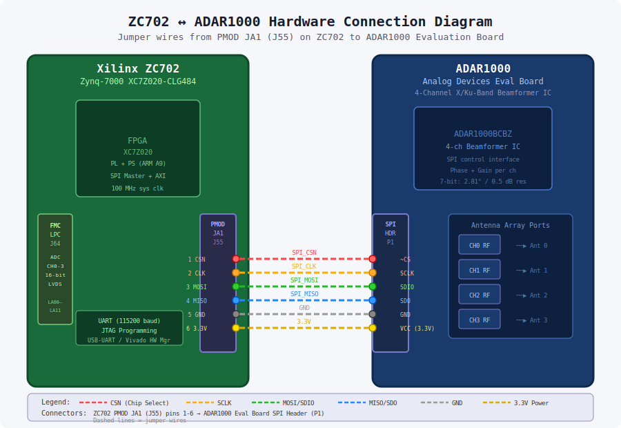
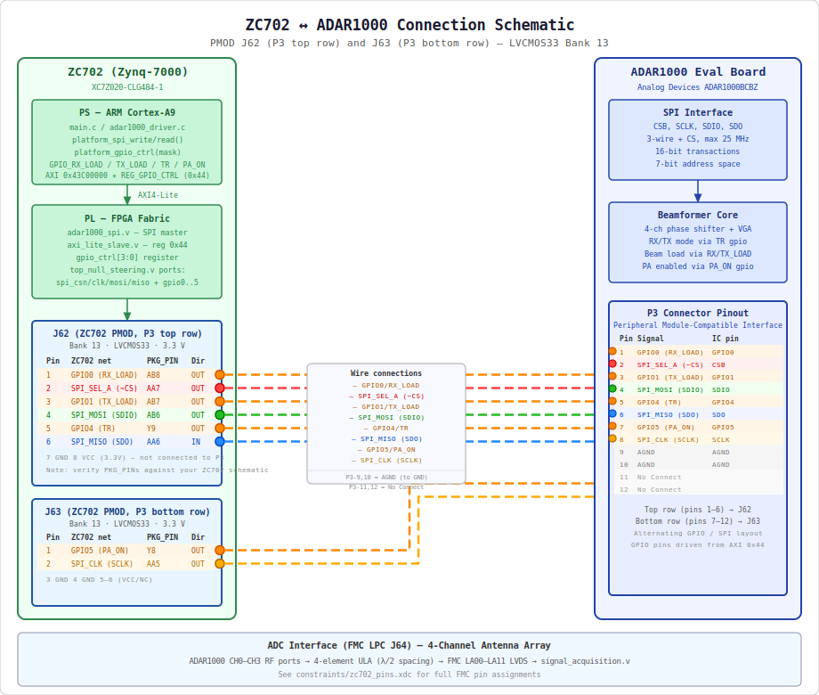

# Anti-Jamming Null Steering System

An FPGA-based adaptive null steering system for anti-jamming, targeting the
**Xilinx ZC702 (Zynq-7000 XC7Z020)** development board with an
**Analog Devices ADAR1000** 4-channel beamformer evaluation board.

The system uses the **MVDR (Minimum Variance Distortionless Response) /
Capon beamformer** algorithm to adaptively place nulls in the direction of
jammers while maintaining gain toward the desired signal.

---

## System Architecture

```
                         ┌─────────────────────────────────────────────┐
                         │         Zynq-7000 XC7Z020                   │
  4-Element              │  PL (FPGA Fabric)                           │
  Antenna Array          │  ┌─────────────┐   ┌──────────────────────┐ │
  ─────────────          │  │   Signal     │   │  Covariance Matrix   │ │
  CH0 ────────┐          │  │ Acquisition  │──▶│  Estimation (Rxx)    │ │
  CH1 ───────┐│  ADC I/F │  │  (4-ch ADC)  │   │  4×4 complex         │ │
  CH2 ──────┐││──────────▶  │             │   │  Hermitian, 256 snap  │ │
  CH3 ─────┐│││          │  └─────────────┘   └──────────┬───────────┘ │
            │││││          │                              │             │
            │││││          │                   ┌──────────▼───────────┐ │
            ││││▼          │  ┌──────────────┐ │   Matrix Inversion   │ │
            │││└──────────▶│  │  Beam Apply  │ │  (Rxx^-1, adjugate  │ │
            │││            │  │ (w^H * x)    │ │   + diag loading)   │ │
            │││            │  └──────┬───────┘ └──────────┬───────────┘ │
            │││            │         │                    │             │
            │││            │  Beam   │         ┌──────────▼───────────┐ │
            │││            │  Output │         │  Weight Computation  │ │
            │││            │         │         │  w = Rxx^-1*a /     │ │
            │││            │         │         │    (a^H*Rxx^-1*a)   │ │
            │││            │         │         └──────────────────────┘ │
            │││            │                                            │
            │││            │  PS (ARM Cortex-A9)                       │
            │││            │  ┌──────────────────────────────────────┐ │
            │││            │  │ main.c: Control Loop                 │ │
            │││            │  │   ▶ Capture → Detect → DOA → MVDR   │ │
            │││            │  │   ▶ Program ADAR1000 via SPI         │ │
            │││            │  └──────────────────────────────────────┘ │
            │││            │                                            │
  ADAR1000 ◀│││────────────│── SPI Master (adar1000_spi.v)            │
  4-ch BF   │││            │                                            │
  IC         │││            │  AXI4-Lite ◀──────────────────────────── │
             ││└────────────│─── AXI Slave (axi_lite_slave.v)          │
             │└─────────────│──                                         │
             └──────────────│─                                          │
                            └─────────────────────────────────────────┘
```

---

## Repository Structure

```
anti-jamming/
├── rtl/                         # Verilog RTL (FPGA PL)
│   ├── signal_acquisition.v     # 4-channel ADC interface + buffering
│   ├── covariance_matrix.v      # 4×4 complex covariance estimation
│   ├── matrix_inverse.v         # 4×4 complex matrix inversion
│   ├── weight_compute.v         # MVDR weight computation
│   ├── beam_apply.v             # Apply weights to antenna signals
│   ├── adar1000_spi.v           # SPI master for ADAR1000
│   ├── axi_lite_slave.v         # AXI4-Lite slave register interface
│   ├── mvdr_beamformer.v        # MVDR pipeline top (cov+inv+weights)
│   └── top_null_steering.v      # Top-level: instantiates all PL modules
│
├── sw/                          # C software (Zynq PS / ARM Cortex-A9)
│   ├── adar1000_driver.h/.c     # ADAR1000 register driver
│   ├── mvdr_algorithm.h/.c      # Software MVDR (reference + fallback)
│   ├── jammer_detect.h/.c       # Jammer power detection
│   ├── doa_estimation.h/.c      # DOA estimation (MUSIC algorithm)
│   ├── platform.h/.c            # ZC702 platform / AXI register helpers
│   └── main.c                   # Main application control loop
│
├── tb/                          # Verilog testbenches
│   ├── tb_covariance_matrix.v   # Covariance matrix unit test
│   ├── tb_mvdr_beamformer.v     # MVDR pipeline test (SOI + jammer scenario)
│   ├── tb_adar1000_spi.v        # SPI controller test
│   └── tb_top_null_steering.v   # Full system integration test
│
├── scripts/
│   └── build_project.tcl        # Vivado TCL build script
│
├── constraints/
│   └── zc702_pins.xdc           # ZC702 pin assignments + timing constraints
│
└── README.md                    # This file
```

---

## Hardware Setup

### Requirements

| Component | Part |
|-----------|------|
| FPGA Board | Xilinx ZC702 (Zynq-7000 XC7Z020-CLG484-1) |
| Beamformer IC | Analog Devices ADAR1000 Evaluation Board |
| Antenna Array | 4-element ULA (half-wavelength spacing at carrier) |
| ADC | FMC-connected ADC with parallel LVDS/LVCMOS output |

### Hardware Connection Diagram

The diagram below shows the ZC702 and ADAR1000 evaluation boards side-by-side
with the six colour-coded jumper wires connecting PMOD JA1 (J55) to the
ADAR1000 SPI header.



### Wiring Schematic

The schematic below details the signal names, pin numbers, direction, and
corresponding IC pins for every connection between the ZC702 and the
ADAR1000 evaluation board.



### ADAR1000 Connections (ZC702 PMOD JA1, J55)

| PMOD Pin | Signal | ADAR1000 Pin |
|----------|--------|--------------|
| JA1-1    | SPI_CSN | ~CS |
| JA1-2    | SPI_CLK | SCLK |
| JA1-3    | SPI_MOSI | SDIO |
| JA1-4    | SPI_MISO | SDO |
| JA1-5    | GND | GND |
| JA1-6    | 3.3V | VCC |

### ADC Connections (ZC702 FMC LPC, J64)

The 4-channel ADC parallel interface uses the FMC LPC LA bank signals.
See `constraints/zc702_pins.xdc` for detailed pin assignments.

---

## Build Instructions

### Prerequisites

- Xilinx Vivado 2020.1 or later (with Zynq-7000 device support)
- Xilinx SDK / Vitis 2020.1 (for PS software build)
- ZC702 board files installed in Vivado

### FPGA Bitstream (PL)

```bash
# Option 1: Batch mode
vivado -mode batch -source scripts/build_project.tcl

# Option 2: Interactive Vivado TCL console
# source scripts/build_project.tcl
```

Outputs:
- `vivado_project/null_steering.runs/impl_1/top_null_steering.bit`
- `vivado_project/timing_summary.rpt`
- `vivado_project/utilization.rpt`

### Software (PS)

Using Xilinx SDK or Vitis:

1. Create a new Application Project for the ZC702 board
2. Add all files in `sw/` to the project
3. Set `sw/main.c` as the application entry point
4. Build with optimization `-O2` and link with `libm`
5. For Xilinx BSP: define `XILINX_ZYNQ` preprocessor macro

```bash
# Host simulation (for algorithm verification without hardware):
gcc -O2 -DSIM_ONLY \
    sw/main.c sw/mvdr_algorithm.c sw/jammer_detect.c \
    sw/doa_estimation.c sw/adar1000_driver.c sw/platform.c \
    -lm -o null_steering_sim
```

### Simulation (Testbenches)

```bash
# Using Xilinx XSim:
xvlog rtl/*.v tb/tb_top_null_steering.v
xelab tb_top_null_steering -s top_sim
xsim top_sim --runall

# Using Icarus Verilog (iverilog):
iverilog -g2005-sv \
    rtl/signal_acquisition.v \
    rtl/covariance_matrix.v \
    rtl/matrix_inverse.v \
    rtl/weight_compute.v \
    rtl/beam_apply.v \
    rtl/adar1000_spi.v \
    rtl/axi_lite_slave.v \
    rtl/mvdr_beamformer.v \
    rtl/top_null_steering.v \
    tb/tb_top_null_steering.v \
    -o top_null_steering_sim
vvp top_null_steering_sim
```

---

## Theory of Operation

### MVDR / Capon Beamformer

The **Minimum Variance Distortionless Response (MVDR)** beamformer minimizes
total output power while maintaining unity gain in the desired look direction.

**Algorithm:**

1. Estimate the spatial covariance matrix from N snapshots:
   ```
   Rxx = (1/N) * X * X^H   where X = [x(0), ..., x(N-1)]
   ```

2. Apply diagonal loading for numerical stability:
   ```
   Rxx_loaded = Rxx + delta * I   (delta = 0.01 * trace(Rxx))
   ```

3. Compute matrix inverse `Rxx^-1` (4×4 complex, adjugate method)

4. Compute steering vector for desired direction θ (ULA, d = λ/2):
   ```
   a[n] = exp(j * π * n * sin(θ)),   n = 0, 1, 2, 3
   ```

5. Compute MVDR weights:
   ```
   w = (Rxx^-1 * a) / (a^H * Rxx^-1 * a)
   ```

6. Apply weights to incoming signals:
   ```
   y = w^H * x
   ```

Jammers appearing at angles other than θ are suppressed (nulled) because
the beamformer minimizes total output power — jammer power is reduced by
placing a null in the jammer's direction.

### System Update Rate

With 100 MHz system clock and 256 snapshots:
- Capture: 256 clock cycles
- Covariance: 256 cycles (one per snapshot)
- Matrix inversion: ~10 clock cycles (pipelined state machine)
- Weight computation: ~5 clock cycles
- **Total: < 600 ns latency** (plus AXI readout)

### Hardware (PL) vs Software (PS) MVDR

| Aspect | PL (FPGA) | PS (ARM) |
|--------|-----------|----------|
| Latency | < 1 µs | ~1 ms |
| Precision | Fixed-point 32-bit | Single-precision float |
| Use case | Real-time tracking | Initialization, fallback |

---

## AXI Register Map

Base address: `0x43C00000` (configurable in Vivado block design)

| Offset | Register | Access | Description |
|--------|----------|--------|-------------|
| 0x00 | CTRL | R/W | [0]=start_capture, [1]=start_cov, [4]=apply_beam |
| 0x04 | STATUS | RO | [0]=cap_done, [1]=cov_valid, [3]=weights_valid, [5]=singular |
| 0x08 | SNAP_COUNT | R/W | Number of snapshots (default 256) |
| 0x0C | DIAG_LOAD | R/W | Diagonal loading (Q16 fixed-point) |
| 0x10 | STEER_ANGLE | R/W | Desired angle (degrees, Q8.8) |
| 0x14 | SPI_CTRL | R/W | [0]=start, [8]=rw, [15:9]=addr, [23:16]=data |
| 0x18 | SPI_STATUS | RO | [0]=spi_busy, [1]=spi_done |
| 0x1C | SPI_RDATA | RO | SPI read data [7:0] |
| 0x20 | W0_RE | RO | Weight[0] real part (Q16) |
| 0x24 | W0_IM | RO | Weight[0] imaginary part (Q16) |
| ... | ... | ... | Weights for channels 1-3 at +0x08 offsets |
| 0x40 | VERSION | RO | Build version (0x00010000 = v1.0) |

---

## Technical Specifications

| Parameter | Value |
|-----------|-------|
| System Clock | 100 MHz |
| ADC Sample Width | 16-bit I/Q per channel |
| Covariance Accumulator | 32-bit fixed-point |
| Matrix Elements | 32-bit real + 32-bit imag |
| Intermediate Precision | 64-bit extended |
| Snapshot Count | Configurable, default 256 |
| Diagonal Loading | 0.01 × trace(Rxx) |
| SPI Clock | 10 MHz (configurable up to 25 MHz) |
| Phase Resolution | 2.8125° (7-bit, 128 steps) |
| Gain Resolution | 0.5 dB (7-bit) |
| AXI Bus | AXI4-Lite, 32-bit data, 32-bit address |

---

## Configuration Parameters

Configurable via AXI registers (runtime) or RTL parameters (compile-time):

- **`N_SNAP`**: Number of snapshots for covariance estimation
- **`DIAG_LOAD`**: Diagonal loading factor (robustness vs. resolution trade-off)
- **`LOOK_ANGLE`**: Desired signal direction in degrees
- **`SPI_CLK_DIV`**: SPI clock divider (100 MHz / (2×N))

---

## Usage Instructions

1. **Program FPGA**: Load bitstream via Vivado Hardware Manager or JTAG
2. **Boot Zynq PS**: Load software binary (ELF) via SDK/Vitis
3. **System starts**: PS initializes ADAR1000, sets broadside steering
4. **Main loop** (automatic):
   - Captures 256 ADC snapshots
   - Detects jammer presence (power threshold)
   - Estimates jammer DOA (MUSIC algorithm)
   - Computes MVDR weights (HW pipeline or SW fallback)
   - Programs ADAR1000 phase/gain registers
   - Applies beamforming in real-time via PL
5. **Monitor via UART** (115200 baud): Status messages and weight values

---

## License

This project is provided for educational and research purposes.
See LICENSE file for details.